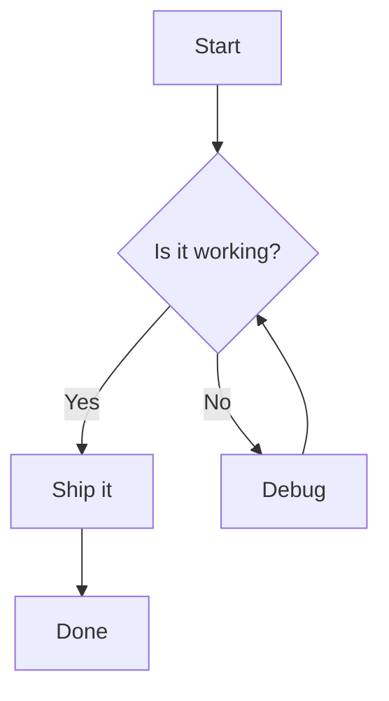
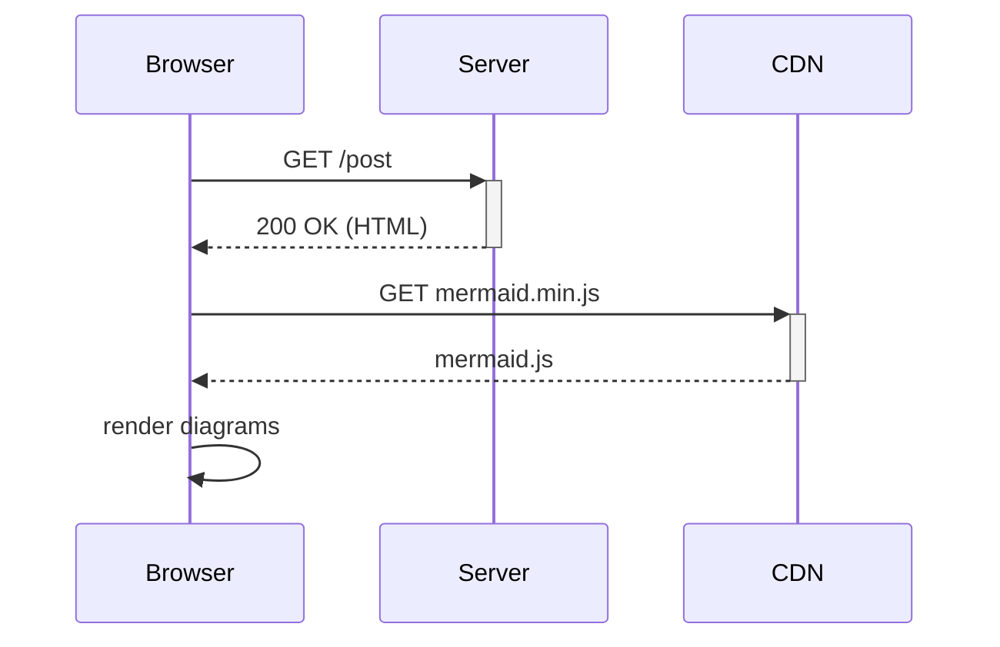
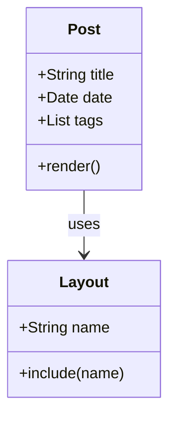

Mermaid is loaded from CDN **only** when the page contains at least one fenced `mermaid` block. If no block exists, zero JS is loaded.

## Flowchart

## Sequence diagram

## Class diagram

Dark mode is handled automatically because Mermaid's `neutral` theme is grayscale and the page-level `invert()` filter handles the flip.
